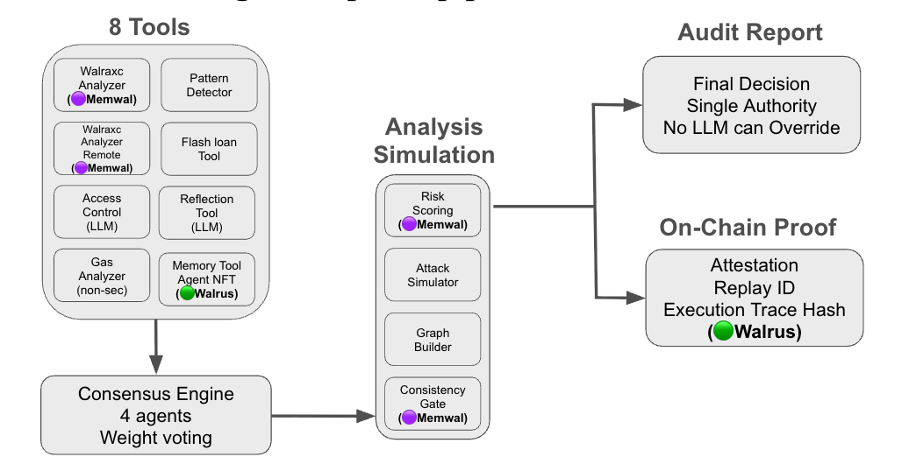
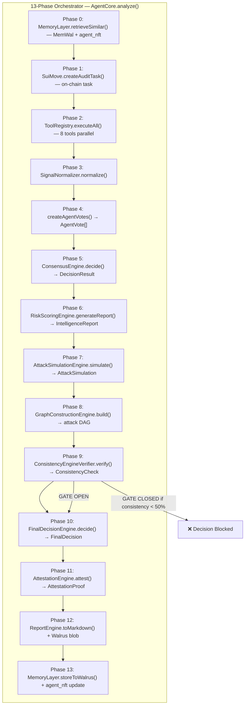

# WALRAXC — Autonomous Exploit Intelligence Core

> **Autonomous security intelligence powered by MemWal, Walrus, and Sui. Persistent memory, consensus-based reasoning, cryptographic attestation, and verifiable audit artifacts for smart contract security.**

[](./backend)
[](./move)
[](https://walrus.xyz)
[](https://memwal.ai)
[](./backend/Dockerfile)
[](https://bun.sh)
[](./frontend)
[](https://www.npmjs.com/package/walraxc)

## 🏗️ Architecture



## 📺 Demo

[](https://youtu.be/zmFDd0voKJo)

---

## 📦 Install

```bash
# Full CLI + agent
npm i walraxc

# Individual packages
npm i @walraxc/agent              # 13-phase deterministic orchestrator
npm i @walraxc/memwal-rag         # Semantic exploit pattern search via MemWal
npm i @walraxc/long-context-memory # Persistent agent memory via Walrus + Sui
npm i @walraxc/walrus-memory      # Verifiable RAG + persistent memory
```

```ts
import { RaxcMemory } from "walraxc";
import { AgentMemory } from "@walraxc/long-context-memory";
import { ExploitRAG } from "@walraxc/memwal-rag";
import { AgentCore } from "@walraxc/agent";

// RAG: search 781 DeFi exploit patterns
const rag = ExploitRAG.fromEnv();
const matches = await rag.search("reentrancy external call");

// Memory: recall 80+ past audit sessions
const mem = AgentMemory.fromEnv();
const sessions = await mem.recall();

// Agent: run the full 13-phase pipeline
const core = new AgentCore(walrus, compute);
const result = await core.analyze(contract, "MyContract");
```

📖 **Full example**: [`packages/examples/all-packages.ts`](./packages/examples/all-packages.ts) — demonstrates RAG search, memory recall, 13-phase pipeline, on-chain proof, and unified context in one file.

---

## The Problem, The Gap, The Solution

### 🔴 The Problem
DeFi protocols are bleeding. Exploits have stolen billions across the ecosystem. Traditional audits cost $10-50K per contract, take weeks, and rely entirely on human review — one missed line means millions lost.

### 🟡 The Gap
AI-powered security scanners exist, but they're mostly ChatGPT wrappers. A single LLM hallucinates findings, can't prove its results, and leaves zero permanent record. Memory is tied to a single session — each audit starts from scratch. You're trusting a black box with user funds. That's not security — that's gambling.

### 🟢 The Solution — WALRAXC
WALRAXC is not an LLM. It's a **deterministic orchestrator** — 8 parallel analysis tools feed into a consensus engine, a consistency gatekeeper blocks invalid decisions, and every result is cryptographically proved with a replay ID and trace hash. Audit reports are stored as **Walrus blobs** with on-chain proof via **Sui Move contracts**. Long-term memory across 60+ sessions via **MemWal RAG** — each audit builds on every past analysis. Same input, same output, every time. Verifiable forever.

---

### ⚔️ Not Just Another Auditor

WALRAXC is not a ChatGPT wrapper. It's a **sovereign execution engine** with a deterministic 13-phase pipeline:

- **8 analysis tools** run in parallel — static analysis, MemWal RAG semantic search, access control, flash loan detection
- **Consensus Engine** aggregates weighted votes — the LLM is just one input, not the authority
- **Attack Simulator** generates VM-like execution paths with state transitions and graph-bound steps
- **Consistency Gatekeeper** blocks any decision where simulation, graph, and tool signals don't align
- **Confidence Engine** is the SINGLE SOURCE OF TRUTH — no module computes confidence independently
- **Final Decision Engine** is the SINGLE AUTHORITY — tools, agents, and LLMs CANNOT override it
- **Attestation Engine** produces a cryptographic replay ID + execution trace hash for every audit
- **On-chain proof** via two Sui Move contracts — `audit_task` for report immutability, `agent_nft` for persistent agent memory with a Merkle trail of every past audit. Reports stored as Walrus blobs — decentralized, verifiable, permanent.
- **Cross-language** — audits both Solidity EVM contracts and Sui Move modules with language-specific vulnerability detection

The result? Every audit comes with a **replay ID** and **trace hash** that prove the exact same input always produces the exact same output. No black box. No trust required.

---

## Architecture

```
┌─────────────────────────────────────────────────────────────────────┐
│                      walraxc CLI (Ink/React)                        │
│            run │ analyze │ list │ show                              │
└─────────────────────────────────┬───────────────────────────────────┘
                                  │ spawns
                                  ▼
┌─────────────────────────────────────────────────────────────────────┐
│              backend/examples/agent-example.ts                      │
│                  WALRAXC Cognition Engine (TypeScript)              │
│                                                                     │
│  1. loadEnv()              Load baked config                        │
│  2. WalrusClient           MemWal RAG semantic search               │
│  3. buildOpenAiClient()    OpenAI GPT-4o-mini + MemWal injection    │
│  4. AgentCore::new()       Assemble multi-tool agent                │
│     ├─ WalraxcAnalyzer      RAG semantic similarity (MemWal)        │
│     ├─ WalraxcAnalyzerRemote Secondary RAG confirmation             │
│     ├─ PatternDetectorTool  CEI / reentrancy patterns               │
│     ├─ GasAnalyzerTool      Gas griefing vectors                    │
│     ├─ FlashLoanTool        Flash loan attack paths                 │
│     ├─ AccessControlTool    Owner / role / module access checks     │
│     ├─ ReflectionTool       Self-review loop (OpenAI critique)      │
│     └─ MemoryTool           Persistent cognition (agent_nft trail)  │
│  5. Parallel execution     All 8 tools run concurrently             │
│  6. SignalNormalizer       Filter noise, lock precision             │
│  7. ConsensusEngine        Weighted multi-agent voting              │
│  8. AttackSimulationEngine VM-like exploit execution                │
│  9. GraphConstructionEngine Deterministic attack DAG                │
│  10. ConsistencyEngine     Gatekeeper — blocks invalid decisions    │
│  11. ConfidenceEngine      SINGLE SOURCE OF TRUTH                   │
│  12. FinalDecisionEngine   SINGLE AUTHORITY — no LLM override       │
│  13. AttestationEngine     Cryptographic replay ID + trace hash     │
│  14. ReportEngine          Markdown report + Walrus blob store      │
│  15. MemoryLayer           Summary blob + agent_nft Merkle update   │
└─────────────────────────────────┬───────────────────────────────────┘
                                  │
              ┌───────────────────┴──────────────────────────┐
              ▼                                              ▼
┌───────────────────────────────┐   ┌─────────────────────────────────┐
│         Sui Testnet           │   │     Walrus + MemWal             │
│                               │   │                                 │
│   audit_task (ERC-8183)       │   │  MemWal RAG (semantic search)   │
│   agent_nft  (ERC-7857)       │   │  raxc/defi-cases namespace      │
│   Cryptographic verification  │   │  60+ session auto recall        │
│                               │   │                                 │
│   Package: 0x79db...          │   │  Walrus Testnet (blob storage)  │
│   Agent NFT: 0x926b...        │   │  Reports + summaries + manifest │
└───────────────────────────────┘   └─────────────────────────────────┘
```

## 🔗 Deployed Contracts — Sui Testnet (Walrus Track)

| Contract | Address | Link |
|----------|---------|------|
| **Package** | `0x79db8cf1f78b8a262bd811ac4688aef5e903eefd8255c95aa1a3e273c46f1694` | [SuiVision →](https://testnet.suivision.xyz/object/0x79db8cf1f78b8a262bd811ac4688aef5e903eefd8255c95aa1a3e273c46f1694) |
| **Agent NFT** | `0x926b7fd348ad27b3d01efa71d7575569a1817a63cb324ac44f6ec6edae78bc0d` | [SuiVision →](https://testnet.suivision.xyz/object/0x926b7fd348ad27b3d01efa71d7575569a1817a63cb324ac44f6ec6edae78bc0d) |
| **WebSocket API** | `wss://walraxc.fly.dev/ws` | [Live →](wss://walraxc.fly.dev/ws) |
| **Frontend** | `walraxc.vercel.app` | [Live →](https://walraxc.vercel.app) |
| **Walrus Blobs** | Reports + Summaries | [Walruscan →](https://walruscan.com) |
| **Sui Move Sources** | `audit_task_8183.move` | [Source →](./move/sources/audit_task_8183.move) |
| **Agent NFT Sources** | `agent_nft_7857.move` | [Source →](./move/sources/agent_nft_7857.move) |

> **RAG Knowledge Base**: The exploit vectors in MemWal are sourced from
> [DeFiHackLabs](https://github.com/SunWeb3Sec/DeFiHackLabs) and
> [DeFiVulnLabs](https://github.com/SunWeb3Sec/DeFiVulnLabs) —
> the most comprehensive open-source repositories of DeFi exploit
> reproductions and vulnerability labs, maintained by [SunWeb3Sec](https://github.com/SunWeb3Sec).

---

## 🐘 Walrus + MemWal — Persistent Agent Memory (Walrus Track)

WALRAXC is built for the **Walrus Track**: AI agents with long-term memory, persistent data, and cross-session intelligence powered by Walrus as a Verifiable Data Platform.

### MemWal — Semantic Long-Term Memory (RAG)

**Purpose**: Give the agent persistent memory that survives across sessions and improves with every audit.

| Feature | Implementation |
|---------|---------------|
| **Namespace** | `raxc/defi-cases` — shared memory space for all exploit patterns |
| **Auto Recall** | Every audit starts by recalling the top 5 most similar past exploits from MemWal |
| **Auto Remember** | Every new finding is automatically stored via `withMemWal` wrapper on OpenAI client |
| **Session Count** | 60+ past audit sessions indexed and searchable |
| **Cross-Tool Sharing** | All 8 analysis tools read from the same MemWal namespace — unified memory |

Unlike traditional vector databases (Qdrant, Pinecone), MemWal provides **persistent, verifiable memory for agents** — data lives on Walrus, not a siloed cloud instance. Anyone with the namespace key can verify what the agent has learned.

### Walrus — Verifiable Blob Storage

**Purpose**: Store every audit artifact immutably on decentralized storage with cryptographic proof.

| Artifact | Storage | On-Chain Link |
|----------|---------|---------------|
| **Full Audit Report** (markdown) | Walrus blob | `audit_task.root_hash` on Sui |
| **Session Summary** (JSON metadata) | Walrus blob | `agent_nft.data_hash` on Sui |
| **Session Manifest** (all blob IDs) | Walrus blob | Local `.raxc-manifest` file |

**Why this matters for the Walrus Track:**

- **Long-running workflows**: 13-phase pipeline tracks state across phases — each phase produces verifiable artifacts on Walrus
- **Multi-agent coordination**: 8 tools run in parallel, share MemWal namespace, consensus engine aggregates results
- **Artifact-driven workflows**: Reports, summaries, and manifests are all Walrus blobs — downloadable, replayable, verifiable
- **Cross-tool memory sharing**: Frontend (`fetchAuditTasks`), CLI (`walraxc list`), and backend agent all read from the same Walrus blobs and MemWal namespace
- **Portable memory**: Not locked to a single app or device — Walrus blobs are accessible via aggregator URL, MemWal via namespace key
- **Developer tooling**: `OpenAiWithMemwalClient` wraps Vercel AI SDK with MemWal auto-recall/remember — plug-and-play for any agent framework

### Memory Flow

```
User pastes contract
        │
        ▼
┌──────────────────────────────────────────┐
│  Phase 0: MemWal Recall                  │
│  "Find top 5 similar past exploits"      │
│  → raxc/defi-cases namespace             │
└──────────────────┬───────────────────────┘
                   │ context injected into LLM prompt
                   ▼
┌──────────────────────────────────────────┐
│  Phase 2-11: Analysis Pipeline           │
│  LLM + 8 tools analyze contract          │
│  MemWal auto-remembers new findings      │
└──────────────────┬───────────────────────┘
                   │
                   ▼
┌──────────────────────────────────────────┐
│  Phase 12: Walrus Blob (Report)          │
│  Full markdown → Walrus blob             │
│  blobId → audit_task on Sui              │
└──────────────────┬───────────────────────┘
                   │
                   ▼
┌──────────────────────────────────────────┐
│  Phase 13: Walrus Blob (Summary)         │
│  JSON metadata → Walrus blob             │
│  blobId → agent_nft Merkle trail         │
│  blobId → manifest (local cache)         │
└──────────────────────────────────────────┘
                   │
                   ▼
         Next audit starts here
         Phase 0 recalls this session
         Agent gets smarter every run
```

---

## How It Works — 13-Phase Pipeline

```
Phase 0  → Load long-term memory (MemWal RAG + agent_nft Merkle trail)
Phase 1  → Create on-chain audit task (audit_task on Sui)
Phase 2  → Dispatch 8 analysis tools in parallel
Phase 3  → Normalize tool signals (filter noise, enforce precision)
Phase 4  → Multi-agent reasoning (convert signals to agent votes)
Phase 5  → Consensus engine (weighted voting aggregation)
Phase 6  → Risk intelligence scoring (severity × confidence × agreement)
Phase 7  → Attack simulation (VM-like execution path + state transitions)
Phase 8  → Graph construction (deterministic attack DAG)
Phase 9  → Consistency verification (4-way gatekeeper)
Phase 10 → Final decision (SINGLE AUTHORITY — no override)
Phase 11 → Attestation proof (cryptographic replay ID + trace hash)
Phase 12 → Markdown report + Walrus blob (full report stored on Walrus)
Phase 13 → Summary blob + agent_nft update (Merkle trail on Sui)
```

### 8 Analysis Tools

| Tool | Detects | Trust Weight |
|------|---------|-------------|
| `WalraxcAnalyzer` | RAG-based exploit matching (MemWal + LLM) | 1.0x |
| `WalraxcAnalyzerRemote` | Secondary RAG confirmation | 1.0x |
| `PatternDetectorTool` | Reentrancy, delegatecall, tx.origin, overflow | 0.8x |
| `FlashLoanTool` | Flash loan callbacks, spot price oracles | 0.7x |
| `AccessControlTool` | Missing access control, unprotected admin/module functions | 0.7x |
| `ReflectionTool` | LLM self-critique (CONFIRMED/REDUCED/REJECTED) | 0.7x |
| `MemoryTool` | Past audit recall from agent_nft manifest | 0.7x |
| `GasAnalyzerTool` | Gas optimizations (non-security) | 0.2x |

---

## Orchestrator Engine Architecture

WALRAXC is built as a **deterministic multi-agent orchestrator** — every component is a specialized engine that feeds into the next, forming a single verifiable audit pipeline with no LLM override.



### Core Classes (agent.ts — 2,200+ lines)

| Class | Role | Key Method |
|-------|------|------------|
| `ToolRegistry` | Pluggable tool system | `register()` / `executeAll()` |
| `SignalNormalizer` | Filters noise, locks precision | `normalize()` / `lockConfidence()` |
| `SeverityLock` | Deterministic severity mapping | `enforce()` |
| `ConsensusEngine` | Weighted multi-agent voting | `decide()` → `DecisionResult` |
| `RiskScoringEngine` | Risk formula: 0.35×severity + 0.25×confidence + 0.2×agreement + 0.2×similarity | `calculate()` / `generateReport()` |
| `AttackSimulationEngine` | 4 simulation types (Reentrancy, AccessControl, FlashLoan, Generic) with graph-linked steps | `simulate()` |
| `GraphConstructionEngine` | Deterministic attack DAG | `build()` |
| `ConsistencyEngineVerifier` | **4-way gatekeeper** — blocks invalid decisions | `verify()` → `ConsistencyCheck` |
| `ConfidenceEngine` | **SINGLE SOURCE OF TRUTH** for confidence | `calculate()` |
| `FinalDecisionEngine` | **SINGLE AUTHORITY** — no LLM/tool override | `decide()` → `FinalDecision` |
| `AttestationEngine` | Cryptographic proof + replay | `attest()` → `AttestationProof` |
| `ReportEngine` | Markdown with 17 standardized sections | `toMarkdown()` |
| `MemoryLayer` | Walrus blob + agent_nft persistence | `storeToWalrus()` / `retrieveSimilar()` |
| `AgentCore` | **13-phase orchestration** | `analyze()` |

### Key Interfaces

| Interface | Purpose |
|-----------|---------|
| `Tool` | Contract for pluggable analysis tools: `name()` + `execute()` |
| `ToolSignal` | Structured ground truth: `vulnerability`, `severity`, `confidence`, `evidence` |
| `AgentVote` | Multi-agent vote: `agentName`, `vulnerability`, `confidence`, `reasoning` |
| `DecisionResult` | Consensus output: `vulnerabilityFound`, `primaryVulnerability`, `riskLevel`, `confidence` |
| `IntelligenceReport` | Risk scoring output: `riskScore`, `exploitabilityScore`, `toolAgreement`, `attackLikelihood` |
| `AttackSimulation` | Complete attack model: `executionPath`, `stateTransitions`, `attackerModel`, `exploitVerdict` |
| `FinalDecision` | Single authority output: `finalVerdict`, `finalConfidence`, `finalRiskScore` |
| `AttestationProof` | Verifiable proof: `replayId`, `seed`, `executionTraceHash`, `timestamp` |
| `AnalysisResult` | Complete audit output: decision + signals + simulation + graph + attestation + markdown |

### Authority Chain

```
ToolRegistry (8 tools parallel) → Raw signals
        ↓
SignalNormalizer               → Filtered signals
        ↓
ConsensusEngine                → DecisionResult
        ↓
RiskScoringEngine              → IntelligenceReport
        ↓
AttackSimulationEngine         → AttackSimulation (4 types, graph-linked)
        ↓
GraphConstructionEngine        → Attack DAG
        ↓
ConsistencyEngineVerifier      → ⛔ GATEKEEPER (blocks if score < 50%)
        ↓
ConfidenceEngine               → SINGLE SOURCE OF TRUTH
        ↓
FinalDecisionEngine             → SINGLE AUTHORITY (no LLM override)
        ↓
AttestationEngine              → Cryptographic proof
        ↓
ReportEngine + MemoryLayer     → Markdown + Walrus blob + agent_nft update
```

❌ **NO module can override `FinalDecisionEngine`** — not tools, not agents, not LLMs.  
✅ **Every execution is deterministic** — same input always produces same output, replay ID, and trace hash.  
✅ **Persistent memory** — 60+ past audit sessions inform every new analysis via MemWal RAG + agent_nft trail.

---

## On-Chain Contracts (Sui Move)

> WALRAXC uses **Sui Move** — a resource-oriented smart contract language with native object ownership and type safety. Two modules provide the on-chain proof layer. Both store Walrus blob IDs as cryptographic proof — no encryption needed, anyone can verify.

### `audit_task` — Audit Task Lifecycle

Stores the full audit report blob ID and cryptographic proof on Sui Testnet.

```move
public fun create_audit_task(registry: &mut TaskRegistry, contract_name: String, timestamp: u64, ctx: &mut TxContext): u64
public fun finalize_audit_task(registry: &mut TaskRegistry, task_id: u64, verdict: String, confidence: u64, root_hash: vector<u8>, replay_id: String, trace_hash: vector<u8>, timestamp: u64)
public fun verify_task(registry: &TaskRegistry, task_id: u64): bool
public fun get_task_count(registry: &TaskRegistry): u64
```

### `agent_nft` — Agent Identity + Persistent Memory

Stores the agent's audit trail as a Merkle tree on Sui Testnet. Every session summary blob ID is appended to the trail — forming an immutable, verifiable history of all past audits.

```move
public fun mint(cap: &AdminCap, registry: &mut Registry, to: address, agent: address, datas: vector<IntelligentData>, ctx: &mut TxContext)
public fun update(nft: &mut AgentNFT, audit_registry: &mut AuditRegistry, clock: &Clock, new_datas: vector<IntelligentData>, ctx: &mut TxContext)
```

Risk levels: `Critical | High | Medium | Low | None`

---

## Language Detection — Solidity + Sui Move

WALRAXC automatically detects the contract language and adjusts its analysis:

| | Solidity | Sui Move |
|---|---|---|
| **Detection** | `pragma solidity`, `contract `, `address` | `module `, `use sui::`, `public entry fun` |
| **Mitigation Checks** | ReentrancyGuard, CEI, SafeMath, TWAP, onlyOwner | Object access control, hot potato, PTB state consistency, type checking |
| **Vulnerability Focus** | Reentrancy, Flash Loan, Access Control, Overflow, Oracle | Unauthorized access, Resource mismanagement, Type confusion, Entry function abuse |

---

## Project Structure

```
walraxc/
├── move/                          # Sui Move contracts
│   ├── sources/
│   │   ├── audit_task_8183.move   # Audit task lifecycle
│   │   └── agent_nft_7857.move    # Agent identity + Merkle trail
│   └── Move.toml
│
├── backend/                       # TypeScript WebSocket server + agent framework
│   ├── src/
│   │   ├── agent.ts               # AgentCore, 14 engines, ReportEngine (2,200+ lines)
│   │   ├── tools.ts               # 8 analysis tools
│   │   ├── sui-client.ts          # Sui Move on-chain client
│   │   ├── walrus-client.ts       # Walrus blob + MemWal RAG client
│   │   ├── openai-withmemwal-client.ts  # OpenAI + MemWal auto recall/remember
│   │   ├── index.ts               # RAG pipeline + analysis prompt
│   │   └── bin/
│   │       ├── ws-server.ts       # WebSocket server (Hono + Bun)
│   │       └── ws-client.ts       # WebSocket CLI client
│   ├── examples/
│   │   └── agent-example.ts       # Standalone CLI example
│   ├── Makefile
│   └── .env
│
├── frontend/                      # Next.js frontend
│   ├── app/
│   │   ├── page.tsx               # Landing page
│   │   └── tx-report/[hash]/      # Walrus blob viewer (supports JSON + markdown)
│   ├── components/                # LiveTerminal, AuditExplorer, StatsSection, etc.
│   └── lib/contracts.ts           # Sui RPC + Walrus HTTP client
│
├── packages/                      # npm packages
│   ├── long-context-memory/       # Agent memory via Walrus blobs + agent_nft trail
│   ├── memwal-rag/                # MemWal semantic search wrapper
│   └── walraxc/                   # Full context composer (manifest + agent_nft)
│
├── dist/                          # Compiled CLI
│   ├── walraxc.mjs               # 1.7MB bundled ESM
│   └── walraxc                   # Shell entry point
│
├── walraxc.tsx                    # Ink/React CLI source
├── build.cjs                      # esbuild bundler config
└── reports/                       # Generated audit reports
```

---

## Quick Start

### Prerequisites

- [Bun](https://bun.sh) ≥ 1.2
- [Docker](https://docker.com) (optional, for deployment)
- API keys: OpenAI, MemWal
- Sui Testnet wallet with SUI (for on-chain proofs)

### 1. Configure Environment

```bash
cd backend
cp .env.example .env
# Edit .env with your keys
```

### 2. Run Locally

```bash
# One-command setup (install + build)
bun run setup

# Or step by step:
cd backend && bun install && cd ..
bun install
node build.cjs

# Standalone CLI analysis
./dist/walraxc run

# Start WebSocket server
cd backend && bun run src/bin/ws-server.ts

# Start frontend (separate terminal)
cd frontend && npx next dev

# Connect with WebSocket client (separate terminal)
bun run src/bin/ws-client.ts
```

### 3. Docker Deployment

```bash
docker compose up -d          # Start server
docker compose logs -f         # Tail logs
curl localhost:3001/health     # Health check
docker compose down            # Stop
```

### 4. WebSocket API

```bash
# Connect
wscat -c ws://localhost:3001/ws

# Send contract for analysis
> {"contract": "pragma solidity ^0.8.0; contract Foo { ... }"}
> {"contract": "module hacker::exploit { ... }"}

# Server streams phase-by-phase progress, then returns final result
```

### Response Format (Server → Client)

| Message Type | Description |
|-------------|-------------|
| `banner` | Welcome/header box |
| `info` | Phase progress (connection, tools, decisions) |
| `progress` | Real-time detail lines (tree format) |
| `explanation` | LLM-generated vulnerability explanation |
| `complete` | Final summary with on-chain tx hashes + Walrus blob IDs |
| `error` | Error message |

---

## Technology Stack

| Layer | Technology |
|-------|-----------|
| **Backend runtime** | [Bun](https://bun.sh) |
| **WebSocket server** | [Hono](https://hono.dev) |
| **LLM** | OpenAI GPT-4o-mini |
| **RAG Memory** | [MemWal](https://memwal.ai) — semantic search + auto recall/remember |
| **Blob Storage** | [Walrus Testnet](https://walrus.xyz) — reports + summaries + manifest |
| **Blockchain** | [Sui Testnet](https://sui.io) |
| **Contracts** | Sui Move — [`audit_task`](https://testnet.suivision.xyz/object/0x79db8cf1f78b8a262bd811ac4688aef5e903eefd8255c95aa1a3e273c46f1694) + [`agent_nft`](https://testnet.suivision.xyz/object/0x926b7fd348ad27b3d01efa71d7575569a1817a63cb324ac44f6ec6edae78bc0d) |
| **On-chain client** | `@mysten/sui` v1.45 |
| **Frontend** | [Next.js 14](https://nextjs.org) + React 18 |
| **CLI** | [Ink](https://github.com/vadimdemedes/ink) (React for terminal) + esbuild |
| **Container** | Docker (Alpine + Bun) |

---

## Secrets Management

`.env` is git-ignored. Required variables:

```env
OPENAI_API_KEY            # https://platform.openai.com/api-keys
OPENAI_MODEL              # e.g. gpt-4o-mini
MEMWAL_PRIVATE_KEY        # MemWal key
MEMWAL_ACCOUNT_ID         # MemWal account
MEMWAL_SERVER_URL         # MemWal relayer URL
SUI_PRIVATE_KEY           # Sui wallet (bech32 suiprivkey...)
SUI_PACKAGE_ID=0x79db8cf1f78b8a262bd811ac4688aef5e903eefd8255c95aa1a3e273c46f1694
SUI_AGENT_NFT_ID=0x926b7fd348ad27b3d01efa71d7575569a1817a63cb324ac44f6ec6edae78bc0d
```

---

## License

MIT

